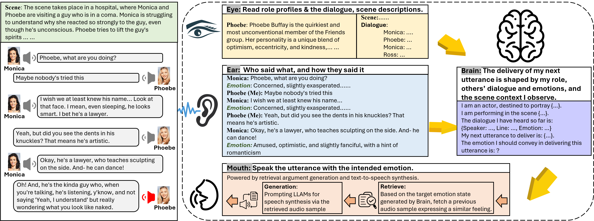
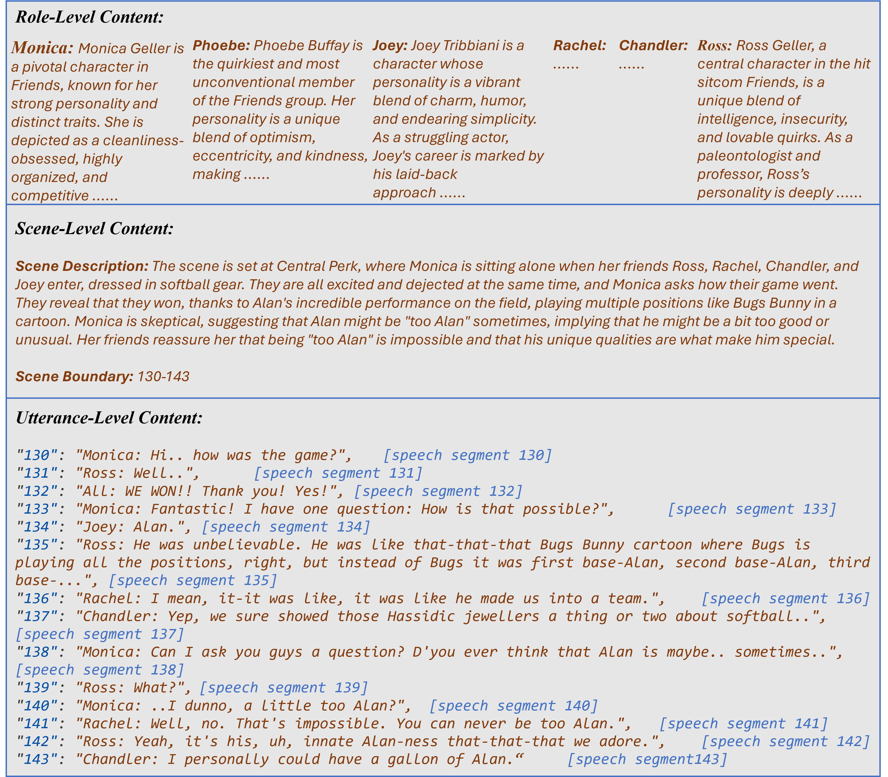

ActorMind: Emulating Human Actor Reasoning for Role-Playing in Large Language-Audio Models
=================


This repository contains benchmark, code, and demo cases for the paper "[ActorMind: Emulating Human Actor Reasoning for Role-Playing in Large Language-Audio Models]()".

**ActorMindBench** is a hierarchical benchmark comprises *Utterance-Level content* with 7,653 utterances, *Scene-Level content* with 313 scenes, and *Role-Level content* with 6 roles. 
**ActorMind** is an off-the-shelf, multi-agent CoT style reasoning framework that emulates how human actors perform in theaters.


<p align="center">
  
</p>

<p align="center">
<!-- [<a href="https://osu-nlp-group.github.io/TravelPlanner/">Website</a>] •
[<a href="http://arxiv.org/abs/2402.01622">Paper</a>] • -->
[<a href="">Benchmark (TBA)</a>] • 
[<a href="">Construction Pipeline (TBA)</a>] • 
[<a href="">Code (TBA)</a>] 
</p> -->


# ActorMindBench

## Example Data

<p align="center">
  
</p>

<!-- ## Construction Pipeline

TBA

# Code

TBA -->

# Demos

## Phoebe

### 📋Role Profile

```
Phoebe Buffay is the quirkiest and most unconventional member of the Friends group. Her personality is a unique blend of optimism, eccentricity, and kindness, making her one of the most memorable and beloved characters in the series. Phoebe’s outlook on life is refreshingly offbeat; she sees the world through a lens of naive charm and unconventional wisdom, often providing a perspective that is both humorous and heartfelt.......
```

### 📋Scene Description 
```
"SE01_11_158_165": The scene takes place in a hospital, where Phoebe is sitting beside a patient, known as Coma Guy, gently stroking his hair. Monica enters the room with a bunch of balloons and greets Phoebe. Monica seems evasive about her presence in the hospital, and Phoebe notices this, questioning her about visiting the patient without her. Monica denies being there to visit the patient, but Phoebe is skeptical, pointing out that changing his pajamas would be a task that requires someone's presence.
```

### 📋▶️ Dialogue
<!--
<audio controls>
  <source src="audio\SE01_11_215_Phoebe_163_00\SE01_11_002_018.wav" type="audio">
  Your browser does not support the audio element.
</audio>
-->


https://github.com/user-attachments/assets/af4d6788-a4ed-4d74-b50f-37f63a4cc60a


```
            "158": "Monica: Hi.",
            "159": "Phoebe: Hi.",
            "160": "Monica: What are you doing here?",
            "161": "Phoebe: Nothing, I just thought I'd stop by.. y'know, after the uh... that I.. y'know, so what are you doing here?",
            "162": "Monica: I'm not really here. Just thought I'd drop these off...on the way.. my way... Do you come here a lot? Without me?",

```
### 📋 Phoebe's Next Line


```
            "163": "Phoebe: ...So, um, do you think he's doing any better than he was this morning?",
```

### Model Outputs


<table>
<tr>
<td align="center">
    
YourTTS
</td>
<td align="center">
    
F5-TTS
</td>
</td>
<td align="center">
    
CosyVoice
</td>
<td align="center">
    
SparkTTS
</td>
</tr>

<tr>
<td align="center">

[YourTTS](https://github.com/user-attachments/assets/c30a8f2a-e853-42ef-bae7-4d72e15837a5)

</td>
<td align="center">
    
[F5-TTS](https://github.com/user-attachments/assets/a8234b3a-b898-4d3b-b043-5759dc1a3444)

</td>
<td align="center">
    
[CosyVoice](https://github.com/user-attachments/assets/efc6492d-6da2-4326-91dc-1da6ef5ddfae)

</td>
<td align="center">
    
[SparkTTS](https://github.com/user-attachments/assets/3aeae27c-6b8b-438d-979a-e3c816bee185)

</td>
</tr>
</table>


<table>
<tr>
<td align="center">
    
Qwen_Omni
</td>
<td align="center">
    
IndexTTS
</td>
<td align="center">
    
ActorMind
</td>
<td align="center">
    
Real Data
</td>
</tr>

<tr>
  <td align="center">
    
[Qwen_Omni](https://github.com/user-attachments/assets/05d00d71-1fe3-4f7e-a4ef-13c30fe286cb)

</td>
<td align="center">
    
[IndexTTS](https://github.com/user-attachments/assets/262a4648-833d-4884-87c4-d9ec5b3d7f0f)

</td>
<td align="center">
    
[ActorMind](https://github.com/user-attachments/assets/005d8995-0bb8-477a-9a58-1a5eb9a30566)

</td>
<td align="center">
    
[Real Data](https://github.com/user-attachments/assets/140b974e-e3c2-4af0-a9a8-dd29ed09b611)

</td>
</tr>
</table>


<!--
| Model | Speech |
|--------|-------------|
| YourTTS | [Listen](https://github.com/user-attachments/assets/c30a8f2a-e853-42ef-bae7-4d72e15837a5)|
| F5-TTS |  [11](https://github.com/user-attachments/assets/a8234b3a-b898-4d3b-b043-5759dc1a3444) |
| CosyVoice | https://github.com/user-attachments/assets/efc6492d-6da2-4326-91dc-1da6ef5ddfae |
| SparkTTS | https://github.com/user-attachments/assets/3aeae27c-6b8b-438d-979a-e3c816bee185 |
| IndexTTS | https://github.com/user-attachments/assets/262a4648-833d-4884-87c4-d9ec5b3d7f0f |
| Qwen\_Omni | https://github.com/user-attachments/assets/05d00d71-1fe3-4f7e-a4ef-13c30fe286cb |
| ActorMind | https://github.com/user-attachments/assets/005d8995-0bb8-477a-9a58-1a5eb9a30566 |
|Real data for reference| https://github.com/user-attachments/assets/140b974e-e3c2-4af0-a9a8-dd29ed09b611|


| Model | Speech |
|--------|-------------|
| YourTTS |  <audio controls>n<source src="audio/SE01_11_215_Phoebe_163_00/yourtts.wav" type="audio"></audio>|
| F5-TTS |  <audio controls>n<source src="audio\SE01_11_215_Phoebe_163_00\f5-tts.wav" type="audio"></audio>|
| CosyVoice |  <audio controls>n<source src="audio\SE01_11_215_Phoebe_163_00\cosyvoice.wav" type="audio"></audio>|
| SparkTTS |  <audio controls>n<source src="audio\SE01_11_215_Phoebe_163_00\sparktts.wav" type="audio"></audio>|
| IndexTTS |  <audio controls>n<source src="audio\SE01_11_215_Phoebe_163_00\indextts.wav" type="audio"></audio>|
| Qwen\_Omni |  <audio controls>n<source src="audio\SE01_11_215_Phoebe_163_00\qwen.wav" type="audio"></audio>|
| ActorMind |  <audio controls>n<source src="audio\SE01_11_215_Phoebe_163_00\ActorMind_indextts_.wav" type="audio"></audio>|
|Real data for reference|<audio controls>n<source src="audio\SE01_11_215_Phoebe_163_00\gt.wav" type="audio"></audio>|

-->


## Joey

### 📋 Role Profile

```
Joey Tribbiani is a character whose personality is a vibrant blend of charm, humor, and endearing simplicity. As a struggling actor, Joey's career is marked by his laid-back approach and occasional bouts of seriousness, yet he remains optimistic and passionate about his craft. His love for food, ......
```

### 📋 Scene Description 
```
"SE01_11_119_156": The scene takes place outside Chandler and Joey's apartment, the next morning. Ross arrives, trying to avoid Chandler, as he had kissed his mother the night before. Joey tries to help Ross come up with an excuse, but Chandler soon appears, and they come up with a story about wanting to play racquetball. However, their alibis fall apart when Ross is unable to produce a racquet or goggles. Rachel and Paolo appear, and Ross is left to face the consequences of his actions. Joey suggests that Ross should tell Chandler about the kiss, but Ross is reluctant, knowing that his mother might reveal the truth. Monica also appears, seemingly oblivious to the situation, but her next line implies that she has already figured out what happened.
```

### 📋▶️ Dialogue
<!--
<audio controls>
  <source src="audio\SE01_11_188_Joey_136_00\SE01_11_119_156.wav" type="audio">
  Your browser does not support the audio element.
</audio>
-->


https://github.com/user-attachments/assets/c1c51f94-d8ae-4b4c-b620-125234089857

```
            "119": "Ross: Hey, is Chandler here?",
            "120": "Joey: Yeah.",
            "121": "Ross: Okay, uh, about last night, um, Chandler.. you didn't tell... Okay, 'cause I'm thinking- we don't need to tell Chandler, I mean, it was just a kiss, right? One kiss? No big deal? Right?",
            "122": "Joey: Right. No big deal.",
            "123": "Ross: Okay.",
            "124": "Joey: In Bizarro World!! You broke the code!",
            "125": "Ross: What code?",
            "126": "Joey: You don't kiss your friend's mom! Sisters are okay, maybe a hot-lookin' aunt... but not a mom, never a mom!",
            "127": "Chandler: What are you guys doing out here?",
            "128": "Ross: Uh.. uh.. Well, Joey and I had discussed getting in an early morning racquetball game. But, um, apparently, somebody overslept.",
            "129": "Joey: Yeah, well, you don't have your racket.",
            "130": "Ross: No, no I don't, because it's being restrung, somebody was supposed to bring me one.",
            "131": "Joey: Yeah, well you didn't call and leave your grip size.",
            "132": "Chandler: Okay, you guys spend waaaay too much time together.",
            "133": "Ross: Okay, I'm scum, I'm scum.",
            "134": "Joey: Ross, how could you let this happen?",
            "135": "Ross: I don't know, God, I... well, it's not like she's a regular mom, y'know? She's, she's sexy, she's...",
```
### 📋 Joey's Next Line
<!-- <audio controls>
  <source src="audio\SE01_11_188_Joey_136_00\gt.wav" type="audio">
  Your browser does not support the audio element.
</audio> -->

```
            "136": "Joey: You don't think my mom's sexy?",
```

### Model Outputs


<table>
<tr>
<td align="center">
    
YourTTS
</td>
<td align="center">
    
F5-TTS
</td>
</td>
<td align="center">
    
CosyVoice
</td>
<td align="center">
    
SparkTTS
</td>
</tr>

<tr>
<td align="center">

[YourTTS](https://github.com/user-attachments/assets/ae74da7e-b038-4bde-9b72-b92b03cb2b9c)
</td>
<td align="center">
    
[F5-TTS](https://github.com/user-attachments/assets/f71158e8-dc2f-459d-a844-6ae185a8cbdf)

</td>
<td align="center">
    
[CosyVoice](https://github.com/user-attachments/assets/b805fcd0-296c-4a2e-8672-6fb41847a159)

</td>
<td align="center">
    
[SparkTTS](https://github.com/user-attachments/assets/9dba04e4-e56c-4ba1-b447-2a64d1417d04)

</td>
</tr>
</table>

<table>
<tr>
<td align="center">
    
Qwen_Omni
</td>
<td align="center">
    
IndexTTS
</td>
<td align="center">
    
ActorMind
</td>
<td align="center">
    
Real Data
</td>
</tr>

<tr>
  <td align="center">
    
[Qwen_Omni](https://github.com/user-attachments/assets/10e7d35d-69f9-43e5-8220-af959b5ec1d1)

</td>
<td align="center">
    
[IndexTTS](https://github.com/user-attachments/assets/4b64ccec-ed9f-4ea9-9170-cf1b54e2603a)

</td>
<td align="center">
    
[ActorMind](https://github.com/user-attachments/assets/e9b45be5-f8ab-42b4-9717-8d488b106a6b)


</td>
<td align="center">
    
[Real Data](https://github.com/user-attachments/assets/6b862633-01a6-423f-b5ea-fec2c8bfe82e)

</td>
</tr>
</table>


<!--
| Model | Speech |
|--------|-------------|
| YourTTS |  <audio controls>n<source src="audio\SE01_11_188_Joey_136_00\yourtts.wav" type="audio"></audio>|
| F5-TTS |  <audio controls>n<source src="audio\SE01_11_188_Joey_136_00\f5-tts.wav" type="audio"></audio>|
| CosyVoice |  <audio controls>n<source src="audio\SE01_11_188_Joey_136_00\cosyvoice.wav" type="audio"></audio>|
| SparkTTS |  <audio controls>n<source src="audio\SE01_11_188_Joey_136_00\sparktts.wav" type="audio"></audio>|
| IndexTTS |  <audio controls>n<source src="audio\SE01_11_188_Joey_136_00\indextts.wav" type="audio"></audio>|
| Qwen\_Omni |  <audio controls>n<source src="audio\SE01_11_188_Joey_136_00\qwen.wav" type="audio"></audio>|
| ActorMind |  <audio controls>n<source src="audio\SE01_11_188_Joey_136_00\ActorMind_indextts_.wav" type="audio"></audio>|
|Real data for reference|<audio controls>n<source src="audio\SE01_11_188_Joey_136_00\gt.wav" type="audio"></audio>|
-->


## Chandler

### 📋 Role Profile

```
Chandler Bing, a central character in the popular sitcom Friends, is renowned for his sharp wit and sarcasm, which serve as both his defense mechanism and a way to navigate social situations. His humor, often self-deprecating, acts as a shield to mask the emotional pain stemming from his troubled childhood, particularly his unconventional family dynamics. Despite his tough exterior, Chandler is deeply loyal to his friends, ......
```

### 📋 Scene Description 
```
"SE01_13_070_106": The scene takes place at Monica and Rachel's apartment, where Joey is sharing his distress about his father's affair. Rachel interrupts Joey's conversation to ask Chandler if he had a good look at her breasts the other day, and a humorous exchange ensues. \n\nHowever, the conversation quickly turns to Ross's marriage to his ex-wife, Carol, who is a lesbian. Roger, a friend, suggests that Ross might have married Carol to compensate for his sibling's failures, making Ross feel more favored by their parents. This sparks a heated argument between Ross and Monica, who accuses Ross of sucking up to their parents and making her look bad.\n\nAs the argument escalates, Rachel chimes in, saying that Ross's marriage to Carol was not just about the lesbian aspect, but also about the Weebles toys he had given her. The conversation becomes increasingly absurd, and Roger eventually intervenes to suggest they leave for a movie.
```

### 📋▶️ Dialogue


https://github.com/user-attachments/assets/89b2a90e-5bad-4582-b919-06940c6c46fc


<!--
<audio controls>
  <source src="audio\SE01_13_094_Chandler_075_00\SE01_13_070_106.wav" type="audio">
  Your browser does not support the audio element.
</audio>
-->

```
            "70": "Joey: It's like if you woke up one day and found out your dad was leading this double life. He's like actually some spy, working for the C.I.A. That'd be cool.... This blows!",
            "71": "Rachel: I know, I mean, why can't parents just stay parents? Why do they have to become people? Why do they have... Why can't you stop staring at my breasts?",
            "72": "Chandler: What? What?",
            "73": "Rachel: Did you not get a good enough look the other day?",
            "74": "Ross: Alright, alright. We're all adults here, there's only one way to resolve this. Since you saw her boobies, I think, uh, you're gonna have to show her your peepee.",
```
### 📋 Chandler's Next Line
<!-- <audio controls>
  <source src="audio\SE01_13_094_Chandler_075_00\gt.wav" type="audio">
  Your browser does not support the audio element.
</audio> -->

```
            "75": "Chandler: Y'know, I don't see that happening?",
```

### Model Outputs


<table>
<tr>
<td align="center">
    
YourTTS
</td>
<td align="center">
    
F5-TTS
</td>
</td>
<td align="center">
    
CosyVoice
</td>
<td align="center">
    
SparkTTS
</td>
</tr>

<tr>
<td align="center">

[YourTTS](https://github.com/user-attachments/assets/2644f89b-efe1-429a-84f3-7ce531d1ee09)

</td>
<td align="center">
    
[F5-TTS](https://github.com/user-attachments/assets/672e43dd-0b3b-4fa8-bf58-c2d57b096e6e)

</td>
<td align="center">
    
[CosyVoice](https://github.com/user-attachments/assets/d3ba2099-557d-4a02-aebd-898f75d93258)

</td>
<td align="center">
    
[SparkTTS](https://github.com/user-attachments/assets/90a1bc3f-611f-4018-aba6-fe4df00192cc)

</td>
</tr>
</table>


<table>
<tr>
<td align="center">
    
Qwen_Omni
</td>
<td align="center">
    
IndexTTS
</td>
<td align="center">
    
ActorMind
</td>
<td align="center">
    
Real Data
</td>
</tr>

<tr>
  <td align="center">
    
[Qwen_Omni](https://github.com/user-attachments/assets/85b31d64-f303-4ff0-a48d-3a1fefd78e04)

</td>
<td align="center">
    
[IndexTTS](https://github.com/user-attachments/assets/b342d878-659a-4990-8ffd-11c655e668f1)

</td>
<td align="center">
    
[ActorMind](https://github.com/user-attachments/assets/26693c0e-ee54-446a-8a60-8d1072fd8f2d)
</td>
<td align="center">
    
[Real Data](https://github.com/user-attachments/assets/97b47fd1-0d50-4bcf-834c-7bd1632f9bf5)
</td>
</tr>
</table>


<!--
| Model | Speech |
|--------|-------------|
| YourTTS |  <audio controls>n<source src="audio\SE01_13_094_Chandler_075_00\yourtts.wav" type="audio"></audio>|
| F5-TTS |  <audio controls>n<source src="audio\SE01_13_094_Chandler_075_00\f5-tts.wav" type="audio"></audio>|
| CosyVoice |  <audio controls>n<source src="audio\SE01_13_094_Chandler_075_00\cosyvoice.wav" type="audio"></audio>|
| SparkTTS |  <audio controls>n<source src="audio\SE01_13_094_Chandler_075_00\sparktts.wav" type="audio"></audio>|
| IndexTTS |  <audio controls>n<source src="audio\SE01_13_094_Chandler_075_00\indextts.wav" type="audio"></audio>|
| Qwen\_Omni |  <audio controls>n<source src="audio\SE01_13_094_Chandler_075_00\qwen.wav" type="audio"></audio>|
| ActorMind |  <audio controls>n<source src="audio\SE01_13_094_Chandler_075_00\ActorMind_indextts_.wav" type="audio"></audio>|
|Real data for reference|<audio controls>n<source src="audio\SE01_13_094_Chandler_075_00\gt.wav" type="audio"></audio>|
-->


## Rachel

### 📋 Role Profile

```
Rachel Green is one of the most dynamic and relatable characters in Friends. Initially introduced as a spoiled, sheltered rich girl, Rachel evolves over the series into a confident, independent woman. Her personality is a mix of kindness, vulnerability, and determination, making her a fan favorite. One of her defining traits is her growth from dependency to self-reliance, as she transitions from living off her father’s wealth to building a successful career in the fashion industry. This journey showcases her resilience and ambition. \n\n Rachel is also known for her sensitivity and emotional depth. She often struggles with insecurities, particularly in her romantic relationships, which adds a layer of realism to her character. ......
```

### 📋 Scene Description 
```
"SE01_13_012_054": The scene is set in Central Perk, a coffee shop where the friends of the main characters, including Ross, Rachel, Monica, Chandler, Joey, and Phoebe, frequently hang out. \n\nThe scene starts with Phoebe telling a story about one of her patients who has a unique way of perceiving reality, where objects can be something else, such as a phone ringing and the patient taking a shower. Her boyfriend Roger is also present and seems to be supportive of Phoebe.\n\nHowever, the conversation quickly takes a turn when Chandler reveals that he accidentally saw Rachel's breasts. Rachel is embarrassed, and the group tries to change the subject. \n\nLater, Roger, who is a shrink, comments on Chandler's use of humor as a way to keep people at a distance, suggesting that Chandler may have intimacy issues. Chandler seems taken aback by this observation.\n\nJust as the conversation is getting interesting, Joey's father, Mr. Tribbiani, arrives at Central Perk. He is a bit of a character and seems to be enjoying the attention. The scene ends with Mr. Tribbiani asking about Ross's wife (presumably Carol, but it is not explicitly stated) and Chandler trying to make a joke to lighten the mood.
```

### 📋▶️ Dialogue
<!--
<audio controls>
  <source src="audio\SE01_13_026_Rachel_031_00\SE01_13_012_054.wav" type="audio">
  Your browser does not support the audio element.
</audio>
-->


https://github.com/user-attachments/assets/eb7aa0dc-2fb1-4aee-99b0-f2ced43d3197


```
            "12": "Phoebe: Oh, honey, honey, tell them the story about your patient who thinks things are, like, other things. Y'know? Like, the phone rings and she takes a shower.",
            "13": "Roger: That's pretty much it.",
            "14": "Phoebe: Oops!",
            "15": "Roger: But you tell it really well, sweetie.",
            "16": "Phoebe: Thanks. Okay, now go away so we can talk about you.",
            "17": "Roger: Okay. I'll miss you.",
            "18": "Phoebe: Isn't he great?",
            "19": "Rachel: He's so cute! And he seems to like you so much.",
            "20": "Phoebe: I know, I know. So sweet... and so complicated. And for a shrink, he's not too shrinky, y'know?",
            "21": "Monica: So, you think you'll do it on his couch?",
            "22": "Phoebe: Oh, I don't know, I don't know. I think that's a little weird, y'know? Vinyl.",
            "23": "Rachel: Okaaay. Any of you guys want anything else?",
            "24": "Chandler: Oh, yes, could I have one of those.",
            "25": "Rachel: No, I'm sorry, we're all out of those. Anybody else?",
            "26": "Chandler: Okay.",
            "27": "Roger: Did I, uh, did I miss something?",
            "28": "Chandler: No, she's still upset because I saw her boobies.",
            "29": "Ross: You what? Wh what were you doing seeing her boobies?",
            "30": "Chandler: It was an accident. Not like I was across the street with a telescope and a box of donuts.",
```
### 📋 Rachel's Next Line
<!-- <audio controls>
  <source src="audio\SE01_13_094_Chandler_075_00\gt.wav" type="audio">
  Your browser does not support the audio element.
</audio> -->

```
            "31": "Rachel: Okay, okay, could we change the subject, please?",
```

### Model Outputs


<table>
<tr>
<td align="center">
    
YourTTS
</td>
<td align="center">
    
F5-TTS
</td>
</td>
<td align="center">
    
CosyVoice
</td>
<td align="center">
    
SparkTTS
</td>
</tr>

<tr>
<td align="center">

[YourTTS](https://github.com/user-attachments/assets/75c7e66b-2c5f-4ff5-92fc-92cff531b3ee)
</td>
<td align="center">
    
[F5-TTS](https://github.com/user-attachments/assets/61b9640f-71c0-4bdf-a437-b0ae636e38a9)

</td>
<td align="center">
    
[CosyVoice](https://github.com/user-attachments/assets/1d9f82c6-cb08-4e15-9c05-2b663eac700c)

</td>
<td align="center">

[SparkTTS](https://github.com/user-attachments/assets/6d27804f-2297-4526-8b9c-3e1e8fa7cdc7)

</td>
</tr>
</table>


<table>
<tr>
<td align="center">
    
Qwen_Omni
</td>
<td align="center">
    
IndexTTS
</td>
<td align="center">
    
ActorMind
</td>
<td align="center">
    
Real Data
</td>
</tr>

<tr>
<td align="center">

[Qwen_Omni](https://github.com/user-attachments/assets/21d4c763-332c-48a4-908c-025fbe2dadb1)

</td>
<td align="center">

[IndexTTS](https://github.com/user-attachments/assets/cc7100bc-5bf6-4dc7-a1f9-76e8c7c1266a)

</td>
<td align="center">
  
[ActorMind](https://github.com/user-attachments/assets/3e4400ea-2007-4669-b81a-9999f5dd06bb)
</td>
<td align="center">
  
[Real Data](https://github.com/user-attachments/assets/2fabc94a-85ce-4f58-9013-fb790b7b9158)

</td>
</tr>
</table>


<!--
| Model | Speech |
|--------|-------------|
| YourTTS |  <audio controls>n<source src="audio\SE01_13_026_Rachel_031_00\yourtts.wav" type="audio"></audio>|
| F5-TTS |  <audio controls>n<source src="audio\SE01_13_026_Rachel_031_00\f5-tts.wav" type="audio"></audio>|
| CosyVoice |  <audio controls>n<source src="audio\SE01_13_026_Rachel_031_00\cosyvoice.wav" type="audio"></audio>|
| SparkTTS |  <audio controls>n<source src="audio\SE01_13_026_Rachel_031_00\sparktts.wav" type="audio"></audio>|
| IndexTTS |  <audio controls>n<source src="audio\SE01_13_026_Rachel_031_00\indextts.wav" type="audio"></audio>|
| Qwen\_Omni |  <audio controls>n<source src="audio\SE01_13_026_Rachel_031_00\qwen.wav" type="audio"></audio>|
| ActorMind |  <audio controls>n<source src="audio\SE01_13_026_Rachel_031_00\ActorMind_indextts_.wav" type="audio"></audio>|
|Real data for reference|<audio controls>n<source src="audio\SE01_13_026_Rachel_031_00\gt.wav" type="audio"></audio>|
-->


## Ross

### 📋 Role Profile

```
Ross Geller, a central character in the hit sitcom Friends, is a unique blend of intelligence, insecurity, and lovable quirks. As a paleontologist and professor, Ross’s personality is deeply rooted in his intellectual side, often making him come across as a nerdy, old-school academic. His love for dinosaurs and ancient history is a defining trait, and his geeky enthusiasm for these subjects often leads to humorous situations. However, Ross’s personality extends far beyond his profession. \n  Ross is a deeply emotional and sensitive character, often struggling with feelings of insecurity and unrequited love, particularly in his on-again, off-again relationship with Rachel Green. His loyalty and dedication to those he cares about are admirable, but they also lead to possessiveness and jealousy, which sometimes put a strain on his relationships. Despite this, Ross is a kind-hearted and well-meaning person who ......
```

### 📋 Scene Description 
```
"SE01_11_119_156": The scene takes place outside Chandler and Joey's apartment, the next morning. Ross arrives, trying to avoid Chandler, as he had kissed his mother the night before. Joey tries to help Ross come up with an excuse, but Chandler soon appears, and they come up with a story about wanting to play racquetball. However, their alibis fall apart when Ross is unable to produce a racquet or goggles. Rachel and Paolo appear, and Ross is left to face the consequences of his actions. Joey suggests that Ross should tell Chandler about the kiss, but Ross is reluctant, knowing that his mother might reveal the truth. Monica also appears, seemingly oblivious to the situation, but her next line implies that she has already figured out what happened.
```

### 📋▶️ Dialogue
<!--
<audio controls>
  <source src="audio\SE01_11_203_Monica_154_00\SE01_11_119_156_1.wav" type="audio">
  Your browser does not support the audio element.
</audio>
-->

[](https://github.com/user-attachments/assets/6605ffd2-8066-455e-a3b5-8a2c30a8ddf8)


```
            "119": "Ross: Hey, is Chandler here?",
            "120": "Joey: Yeah.",
            "121": "Ross: Okay, uh, about last night, um, Chandler.. you didn't tell... Okay, 'cause I'm thinking- we don't need to tell Chandler, I mean, it was just a kiss, right? One kiss? No big deal? Right?",
            "122": "Joey: Right. No big deal.",
            "123": "Ross: Okay.",
            "124": "Joey: In Bizarro World!! You broke the code!",
            "125": "Ross: What code?",
            "126": "Joey: You don't kiss your friend's mom! Sisters are okay, maybe a hot-lookin' aunt... but not a mom, never a mom!",
            "127": "Chandler: What are you guys doing out here?",
            "128": "Ross: Uh.. uh.. Well, Joey and I had discussed getting in an early morning racquetball game. But, um, apparently, somebody overslept.",
            "129": "Joey: Yeah, well, you don't have your racket.",
            "130": "Ross: No, no I don't, because it's being restrung, somebody was supposed to bring me one.",
            "131": "Joey: Yeah, well you didn't call and leave your grip size.",
            "132": "Chandler: Okay, you guys spend waaaay too much time together.",
            "133": "Ross: Okay, I'm scum, I'm scum.",
            "134": "Joey: Ross, how could you let this happen?",
            "135": "Ross: I don't know, God, I... well, it's not like she's a regular mom, y'know? She's, she's sexy, she's...",
            "136": "Joey: You don't think my mom's sexy?",
```
### 📋 Ross's Next Line

<!-- <audio controls>
  <source src="audio\SE01_13_094_Chandler_075_00\gt.wav" type="audio">
  Your browser does not support the audio element.
</audio> -->

```
            "137": "Ross: Well... not in the same way...",
```

### Model Outputs


<table>
<tr>
<td align="center">
    
YourTTS
</td>
<td align="center">
    
F5-TTS
</td>
</td>
<td align="center">
    
CosyVoice
</td>
<td align="center">
    
SparkTTS
</td>
</tr>

<tr>
<td align="center">

[YourTTS](https://github.com/user-attachments/assets/12de760d-06de-4365-94b2-05e550d20821)

</td>
<td align="center">
    
[F5-TTS](https://github.com/user-attachments/assets/cd4d7150-1a74-495c-b441-02e76f5dab52)

</td>
<td align="center">
    
[CosyVoice](https://github.com/user-attachments/assets/71adf5f0-b6ec-4262-b1e7-ff5a2aed28d9)

</td>
<td align="center">
    
[SparkTTS](https://github.com/user-attachments/assets/6890cf2d-74ae-41c8-bf4b-e947526b486d)

</td>
</tr>
</table>


<table>
<tr>
<td align="center">
    
Qwen_Omni
</td>
<td align="center">
    
IndexTTS
</td>
<td align="center">
    
ActorMind
</td>
<td align="center">
    
Real Data
</td>
</tr>

<tr>
  <td align="center">
    
[Qwen_Omni](https://github.com/user-attachments/assets/219ab18a-18ba-43ba-bcb5-a7cf501bbaa9)

</td>
<td align="center">
    
[IndexTTS](https://github.com/user-attachments/assets/70605e22-b096-4720-a727-48dff7a4a226)
</td>
<td align="center">
    
[ActorMind](https://github.com/user-attachments/assets/e345f312-760f-40f0-96c4-5ece6a579f40)
</td>
<td align="center">
    
[Real Data](https://github.com/user-attachments/assets/68eff2dc-8b55-49b3-abff-5e3dbe99b30e)
</td>
</tr>
</table>


<!--
| Model | Speech |
|--------|-------------|
| YourTTS |  <audio controls>n<source src="audio\SE01_11_189_Ross_137_00\yourtts.wav" type="audio"></audio>|
| F5-TTS |  <audio controls>n<source src="audio\SE01_11_189_Ross_137_00\f5-tts.wav" type="audio"></audio>|
| CosyVoice |  <audio controls>n<source src="audio\SE01_11_189_Ross_137_00\cosyvoice.wav" type="audio"></audio>|
| SparkTTS |  <audio controls>n<source src="audio\SE01_11_189_Ross_137_00\sparktts.wav" type="audio"></audio>|
| IndexTTS |  <audio controls>n<source src="audio\SE01_11_189_Ross_137_00\indextts.wav" type="audio"></audio>|
| Qwen\_Omni |  <audio controls>n<source src="audio\SE01_11_189_Ross_137_00\qwen.wav" type="audio"></audio>|
| ActorMind |  <audio controls>n<source src="audio\SE01_11_189_Ross_137_00\ActorMind_indextts_.wav" type="audio"></audio>|
|Real data for reference|<audio controls>n<source src="audio\SE01_11_189_Ross_137_00\gt.wav" type="audio"></audio>|
-->


## Monica

### 📋 Role Profile

```
Monica Geller is a pivotal character in Friends, known for her strong personality and distinct traits. She is depicted as a cleanliness-obsessed, highly organized, and competitive individual who often takes charge in group situations. Monica’s perfectionism and meticulous nature are central to her character, often leading to humorous yet relatable moments. Her need for control and order in life stems from her upbringing, shaping her into a disciplined and driven person. \n Monica is also incredibly caring and nurturing, often acting as the \"mom\" of the group. She genuinely looks out for her friends, offering support and encouragement, especially when they are going through tough times. Her determination and work ethic are evident in her successful career as a chef, showcasing her passion and dedication......
```

### 📋 Scene Description 
```
"SE01_11_119_156": The scene takes place outside Chandler and Joey's apartment, the next morning. Ross arrives, trying to avoid Chandler, as he had kissed his mother the night before. Joey tries to help Ross come up with an excuse, but Chandler soon appears, and they come up with a story about wanting to play racquetball. However, their alibis fall apart when Ross is unable to produce a racquet or goggles. Rachel and Paolo appear, and Ross is left to face the consequences of his actions. Joey suggests that Ross should tell Chandler about the kiss, but Ross is reluctant, knowing that his mother might reveal the truth. Monica also appears, seemingly oblivious to the situation, but her next line implies that she has already figured out what happened. 
```

### 📋▶️ Dialogue
<！--
<audio controls>
  <source src="audio\SE01_11_203_Monica_154_00\SE01_11_119_156.wav" type="audio">
  Your browser does not support the audio element.
</audio>
-->


[](https://github.com/user-attachments/assets/c2a0b530-2784-4e99-8845-83648e98f601)


```
            "119": "Ross: Hey, is Chandler here?",
            "120": "Joey: Yeah.",
            "121": "Ross: Okay, uh, about last night, um, Chandler.. you didn't tell... Okay, 'cause I'm thinking- we don't need to tell Chandler, I mean, it was just a kiss, right? One kiss? No big deal? Right?",
            "122": "Joey: Right. No big deal.",
            "123": "Ross: Okay.",
            "124": "Joey: In Bizarro World!! You broke the code!",
            "125": "Ross: What code?",
            "126": "Joey: You don't kiss your friend's mom! Sisters are okay, maybe a hot-lookin' aunt... but not a mom, never a mom!",
            "127": "Chandler: What are you guys doing out here?",
            "128": "Ross: Uh.. uh.. Well, Joey and I had discussed getting in an early morning racquetball game. But, um, apparently, somebody overslept.",
            "129": "Joey: Yeah, well, you don't have your racket.",
            "130": "Ross: No, no I don't, because it's being restrung, somebody was supposed to bring me one.",
            "131": "Joey: Yeah, well you didn't call and leave your grip size.",
            "132": "Chandler: Okay, you guys spend waaaay too much time together.",
            "133": "Ross: Okay, I'm scum, I'm scum.",
            "134": "Joey: Ross, how could you let this happen?",
            "135": "Ross: I don't know, God, I... well, it's not like she's a regular mom, y'know? She's, she's sexy, she's...",
            "136": "Joey: You don't think my mom's sexy?",
            "137": "Ross: Well... not in the same way...",
            "138": "Joey: I'll have you know that Gloria Tribbiani was a handsome woman in her day, alright? You think it's easy giving birth to seven children?",
            "139": "Ross: Okay, I think we're getting into a weird area here...",
            "140": "Rachel: Hey.",
            "141": "Ross: Hey.",
            "142": "Rachel: What're you guys doing out here?",
            "143": "Ross: Well, not playing raquetball!",
            "144": "Joey: He forgot to leave his grip size!",
            "145": "Ross: He didn't get the goggles!",
            "146": "Rachel: Well,sounds like you two have issues.",
            "147": "Rachel: Goodbye, baby.",
            "148": "Paolo: Ciao, bela.",
            "149": "Ross: Do they wait for me to do this?",
            "150": "Joey: So are you gonna tell him?",
            "151": "Ross: Why would I tell him?",
            "152": "Joey: How about 'cause if you don't, his mother might.",
            "153": "Ross: Oh...",
```
### 📋 Monica's Next Line
<!-- <audio controls>
  <source src="audio\SE01_13_094_Chandler_075_00\gt.wav" type="audio">
  Your browser does not support the audio element.
</audio> -->

```
            "154": "Monica: What are you guys doing here?",
```

### Model Outputs


<table>
<tr>
<td align="center">
    
YourTTS
</td>
<td align="center">
    
F5-TTS
</td>
</td>
<td align="center">
    
CosyVoice
</td>
<td align="center">
    
SparkTTS
</td>
</tr>

<tr>
<td align="center">

[YourTTS](https://github.com/user-attachments/assets/36c956cd-0b22-493e-8069-c9564511b422)

</td>
<td align="center">
    
[F5-TTS](https://github.com/user-attachments/assets/25a844bd-a5c2-481d-8336-9d72a9a92f50)
</td>
<td align="center">
    
[CosyVoice](https://github.com/user-attachments/assets/7d613110-aaf3-42a9-8e27-7d6100cd535d)

</td>
<td align="center">
    
[SparkTTS](https://github.com/user-attachments/assets/b8f402f3-5796-4d8c-af54-b2417d8d6ffb)

</td>
</tr>
</table>


<table>
<tr>
<td align="center">
    
Qwen_Omni
</td>
<td align="center">
    
IndexTTS
</td>
<td align="center">
    
ActorMind
</td>
<td align="center">
    
Real Data
</td>
</tr>

<tr>
<td align="center">

[Qwen_Omni](https://github.com/user-attachments/assets/a926de8c-931e-4e22-8d5f-39d66a9e15b7)

</td>
<td align="center">
    
[IndexTTS](https://github.com/user-attachments/assets/388d388f-2daf-45bb-9fcd-0058ed44ade6)

</td>
<td align="center">
    
[ActorMind](https://github.com/user-attachments/assets/b91f8c6f-4099-45d4-b87e-693a50c374a3)

</td>
<td align="center">
    
[Real Data](https://github.com/user-attachments/assets/d2a3f0c3-66e1-4556-a5b7-d1a59c4a94dc)


</td>
</tr>
</table>


<!--
| Model | Speech |
|--------|-------------|
| YourTTS |  <audio controls>n<source src="audio\SE01_11_203_Monica_154_00\yourtts.wav" type="audio"></audio>|
| F5-TTS |  <audio controls>n<source src="audio\SE01_11_203_Monica_154_00\f5-tts.wav" type="audio"></audio>|
| CosyVoice |  <audio controls>n<source src="audio\SE01_11_203_Monica_154_00\cosyvoice.wav" type="audio"></audio>|
| SparkTTS |  <audio controls>n<source src="audio\SE01_11_203_Monica_154_00\sparktts.wav" type="audio"></audio>|
| IndexTTS |  <audio controls>n<source src="audio\SE01_11_203_Monica_154_00\indextts.wav" type="audio"></audio>|
| Qwen\_Omni |  <audio controls>n<source src="audio\SE01_11_203_Monica_154_00\qwen.wav" type="audio"></audio>|
| ActorMind |  <audio controls>n<source src="audio\SE01_11_203_Monica_154_00\ActorMind_indextts_.wav" type="audio"></audio>|
|Real data for reference|<audio controls>n<source src="audio\SE01_11_203_Monica_154_00\gt.wav" type="audio"></audio>|
-->


# Citation


TBA


<!--
<table>
<tr>
<td align="center">
    
YourTTS
</td>
<td align="center">
    
F5-TTS
</td>
</td>
<td align="center">
    
CosyVoice
</td>
<td align="center">
    
SparkTTS
</td>
</tr>

<tr>
<td align="center">

[YourTTS]()

</td>
<td align="center">
    
[F5-TTS]()

</td>
<td align="center">
    
[CosyVoice](])

</td>
<td align="center">
    
[SparkTTS]()

</td>
</tr>
</table>


<table>
<tr>
<td align="center">
    
Qwen_Omni
</td>
<td align="center">
    
IndexTTS
</td>
<td align="center">
    
ActorMind
</td>
<td align="center">
    
Real Data
</td>
</tr>

<tr>
  <td align="center">
    
[Qwen_Omni]()

</td>
<td align="center">
    
[IndexTTS]()

</td>
<td align="center">
    
[ActorMind]()

</td>
<td align="center">
    
[Real Data]()

</td>
</tr>
</table>

-->


